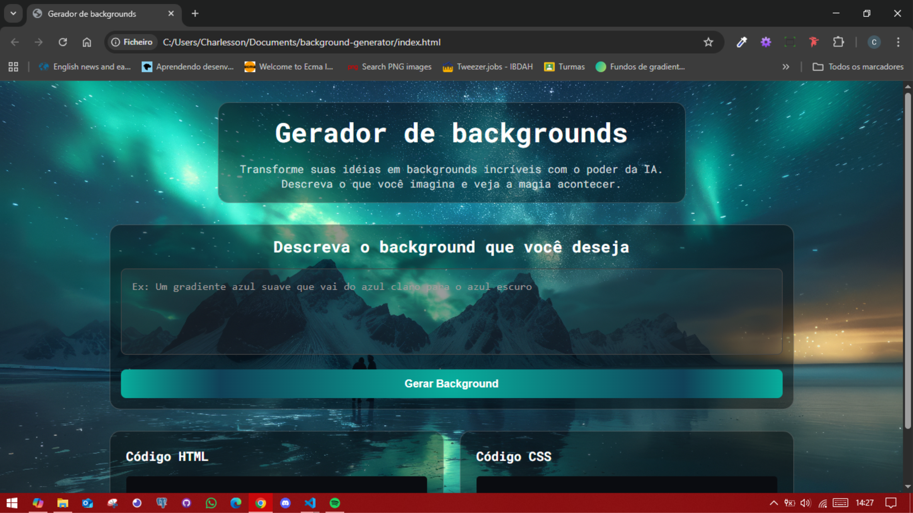

# 🎨 Background Generator

**Background Generator** é uma aplicação web que utiliza inteligência artificial para gerar códigos de **backgrounds personalizados** em HTML e CSS a partir de uma descrição textual.  
Basta digitar o que você imagina — por exemplo, “um gradiente azul suave que vai do azul claro para o azul escuro” — e ver o resultado na hora!

---

## 🖼️ Preview



---

## 🚀 Tecnologias Utilizadas

- **HTML5** – estrutura da aplicação  
- **CSS3** – estilização responsiva e animações  
- **JavaScript (ES6)** – integração com API e manipulação dinâmica do DOM  
- **n8n API** – processamento da descrição e geração do código  
- **Google Fonts (Roboto Mono)** – tipografia moderna  

---

## 📂 Estrutura de Arquivos

```
background-generator/
├── index.html
├── src/
│ ├── css/
│ │ ├── reset.css
│ │ ├── style.css
│ │ └── responsive.css
│ ├── js/
│ │ └── script.js
│ └── images/
│ │ ├── background.png
│ │ └── preview.png
└── README.md
```


---

## 💻 Como Acessar o Projeto

### 🔗 Opção 1 — Acessar Online
Você pode acessar diretamente pelo **GitHub Pages**: https://charlesson-mp.github.io/background-generator/


### 🧩 Opção 2 — Clonar e Executar Localmente
```bash
# Clonar o repositório
git clone https://github.com/charlesson-mp/background-generator.git

# Entrar na pasta do projeto
cd background-generator

# Abrir no navegador
# (basta clicar duas vezes no arquivo index.html)
```

---

## ⚙️ Como Funciona

1. O usuário descreve o tipo de background desejado no campo de texto.

2. O JavaScript envia essa descrição para um webhook do n8n, que interpreta e retorna código HTML e CSS.

3. O resultado é exibido automaticamente em:

    - uma área de preview;

    - blocos de código para copiar o HTML e o CSS.

4. O botão mostra um loading animado enquanto o fundo é gerado.

---

## 📜 Licença

Este projeto está licenciado sob a GNU License — veja o arquivo LICENSE para mais detalhes.

## ⚠️ Atenção

Este projeto funcionará até 19/10/2025 devido ao fim do período de teste do n8n. Após essa data, apenas o front-end ficará disponível.